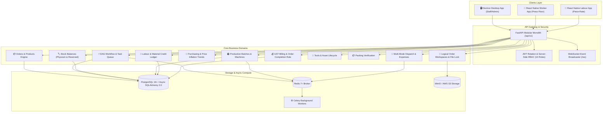

<div align="center">

# 🏭 OfficeFloww

### Industrial Production Management & Office Automation Operating System

[](https://www.python.org/)
[](https://fastapi.tiangolo.com/)
[](https://www.sqlalchemy.org/)
[](https://www.postgresql.org/)
[](https://docs.celeryq.dev/)
[](https://www.typescriptlang.org/)
[-brightgreen?style=for-the-badge&logo=pytest&logoColor=white)](apps/api/tests/)

<p align="center">
  <b>A centralized, production-grade operating system engineered for high-volume commercial printing facilities</b><br>
  Specialized for ID Cards, Multicolor Printed Lanyards (MPL), Badges, Acrylic Badges, Invitations, Marksheets, and Custom Engineered Print Products.
</p>

</div>

---

## 📑 Table of Contents

- [Overview & Problem Space](#-overview--problem-space)
- [System Architecture](#-system-architecture)
- [Core Operational Domains](#-core-operational-domains)
- [Key Business Invariants](#-key-business-invariants)
- [Repository Layout](#-repository-layout)
- [Quick Start Guide](#-quick-start-guide)
- [Pre-Configured Seed Accounts](#-pre-configured-seed-accounts)
- [Automated Test Suite](#-automated-test-suite)
- [TypeScript Client & Contract Packages](#-typescript-client--contract-packages)
- [Docker Production Infrastructure](#-docker-production-infrastructure)
- [Comprehensive Documentation Suite](#-comprehensive-documentation-suite)

---

## 🎯 Overview & Problem Space

Commercial printing facilities run on high SKU variety, tight turnaround times (24h–72h), high customer proof revisions, multi-tier outside piece-rate contractors, and volatile raw material pricing.

**OfficeFloww** replaces disconnected spreadsheets, WhatsApp threads, and physical job slips with a unified digital backbone:

```
[ Clients & Orders ] ──► [ BOM & Stock Reservation ] ──► [ DAG Workflow & Task Queue ]
                                                                   │
[ Delivery & Logistics ] ◄── [ Dual-Signoff Packing ] ◄── [ Machine & Labour Batches ]
         │
[ Billing & Order Completion Invariant ] ──► [ Financial Ledger & Audit Trail ]
```

---

## 🏛️ System Architecture

OfficeFloww is architected as a high-performance **Modular Monolith** in FastAPI with strict bounded domain contexts:



---

## 🧩 Core Operational Domains

| Domain | Key Capabilities | REST Prefix |
| :--- | :--- | :--- |
| **Authentication & RBAC** | JWT access tokens (60m) + rotating refresh tokens (7d), 10 server-side RBAC roles. | `/auth`, `/users` |
| **Clients & Contacts** | Multi-contact directories, GSTIN tax validation, multi-tier billing/delivery addresses. | `/clients` |
| **Products & BOM** | Configurable catalog, multi-component BOM with wastage markup percentages. | `/products` |
| **Orders & Workflows** | Multi-product orders with independent DAG workflow execution and task queues. | `/orders`, `/workflows` |
| **Files & Approvals** | Logical order workspaces (`ORD-xxxx/`), SHA-256 integrity checksums, approval states. | `/files`, `/approvals` |
| **Stock Engine** | Physical vs Reserved vs Available separation, 9 movement types, BOM reservations. | `/stock` |
| **Suppliers & Purchasing** | Shortage detection, PO approval workflow, GRN receipts, price inflation tracking. | `/purchasing` |
| **Production & Batches** | Machine speeds/setups, deterministic batch codes, **Production File Lock Guard**. | `/production` |
| **Labour & Material Credit** | Outside contractor directory, **Labour Material Credit Ledger**, accepted-piece payouts. | `/labour` |
| **Tools & Assets** | Tool crib inventory, condition state machine (`EXCELLENT` $\to$ `LOST`), check-in/out. | `/assets` |
| **Packing & Quality** | Container aggregation (`BOX`, `BUNDLE`, `CARTON`), dual packer-verifier sign-off. | `/packing` |
| **Dispatch & Expenses** | Bus cargo, courier, and tempo logistics, out-of-pocket expense reimbursement ledger. | `/dispatch` |
| **Billing & Completion** | GST-compliant invoicing, client ledger, **Tripartite Order Completion Invariant**. | `/billing` |
| **Worker Mobile Operations** | Sanitized floor endpoints for operators (timers, instructions, defect logging). | `/worker` |

---

## 🔒 Key Business Invariants

### 1. Stock Separation: Physical vs Reserved vs Available
$$\text{Available Stock} = \text{Physical Stock} - \text{Reserved Stock}$$
Reserving material on order confirmation places a hold without decrementing physical inventory. Material is consumed only when loaded on machines or issued to workers.

### 2. The Production File Lock Guard
Presses must never run on unapproved artwork. `ProductionBatch` enforces that referenced `FileVersion` must be in state `APPROVED`. Revisions create immutable new versions requiring fresh approval.

### 3. Labour Material Credit Ledger
Hardware issued to outside workers in bulk (e.g. 1,000 metal hooks for a 700-lanyard job) is tracked non-destructively as company-owned material in `LabourStockLedger`. Subsequent jobs credit the remaining balance (300) and issue only the net deficit (1,000 for a 1,300 job).

### 4. Strict Accepted-Piece Labour Compensation
$$\text{Payable Amount} = Q_{\text{accepted}} \times \text{Rate Per Unit}$$
Payouts are calculated **strictly from verified good output**, never from issued raw material or defective units.

### 5. Tripartite Order Completion Invariant
$$\text{Can Complete} = \mathcal{C}_{\text{workflows}} \land \mathcal{C}_{\text{quantities}} \land \mathcal{C}_{\text{packing}}$$
Orders cannot be marked `COMPLETED` by button clicks. The engine cryptographically enforces that:
1. All workflow step instances across all items are `COMPLETED` or `SKIPPED`.
2. All packing tasks are verified and complete.
3. Net packed good units match or exceed ordered quantities.

---

## 📁 Repository Layout

```
OfficeFloww/
├── apps/
│   ├── api/                # FastAPI Modular Monolith Backend
│   │   ├── app/            # Domain modules (auth, orders, stock, labour, billing, etc.)
│   │   ├── alembic/        # Database migrations (PostgreSQL / SQLite)
│   │   └── tests/          # Comprehensive Pytest test suite (26 tests, 100% pass)
│   ├── desktop/            # Electron + React + TypeScript Desktop App Stub
│   ├── worker-app/         # React Native Shop-Floor Operator App Stub
│   └── labour-app/         # React Native Outside Labour Piece-Rate App Stub
├── packages/
│   ├── api-types/          # TypeScript interfaces generated from OpenAPI schema
│   ├── api-client/         # Typed HTTP client library with auth token management
│   └── validation/         # Shared validation rules (GSTIN, Phone, Quantities)
├── docker/                 # Dockerfiles, MinIO initialization, Compose definitions
├── docs/                   # 28 architectural and domain specification documents
├── scripts/
│   ├── seed.py             # Realistic printing company seed data script
│   ├── generate_contracts.py # OpenAPI schema exporter
│   └── run_dev.py          # Local development runner
├── README.md
├── CHANGELOG.md
├── DECISIONS.md
├── .env.example
├── docker-compose.yml
└── pytest.ini
```

---

## 🚀 Quick Start Guide

### 1. Prerequisites
- Python 3.11+
- Node.js 18+ (for TypeScript packages)
- Docker & Docker Compose (optional for local full stack)

### 2. Backend Setup
```bash
# 1. Install Python dependencies
pip install -r apps/api/requirements.txt

# 2. Run database migrations
alembic upgrade head

# 3. Seed realistic printing company data
python scripts/seed.py

# 4. Launch development API server
python scripts/run_dev.py
```

- **Interactive Swagger UI**: [http://localhost:8000/docs](http://localhost:8000/docs)
- **ReDoc Documentation**: [http://localhost:8000/redoc](http://localhost:8000/redoc)
- **OpenAPI 3.1 JSON**: [http://localhost:8000/openapi.json](http://localhost:8000/openapi.json)

---

## 🔑 Pre-Configured Seed Accounts

All pre-configured seed accounts use default password: **`OfficeFloww@2026`**

| Email | Name | Role | Operational Responsibilities |
| :--- | :--- | :--- | :--- |
| `owner@officefloww.com` | Vikram Malhotra | `OWNER` | Full enterprise control, financials, settings |
| `admin@officefloww.com` | Rohan Sharma | `ADMIN` | System administrator, user provisioning |
| `manager@officefloww.com` | Priya Nair | `MANAGER` | Production scheduling & client proof approvals |
| `sales@officefloww.com` | Arjun Kapoor | `SALES` | Client onboarding & order intake |
| `designer@officefloww.com` | Sneha Roy | `DESIGNER` | Artwork uploads, VDP merging, proofing |
| `dataop@officefloww.com` | Amit Verma | `DATA_OPERATOR` | Student data roster entry, photo cropping |
| `prodmgr@officefloww.com` | Rajesh Gupta | `PRODUCTION_MANAGER` | Machine dispatch, PO approvals, batch allocations |
| `machineop@officefloww.com`| Dinesh Kumar | `MACHINE_OPERATOR` | Thermal presses, sublimation, ultrasonic cutters |
| `packingop@officefloww.com`| Sunil Yadav | `PACKING_OPERATOR` | Box packing, verification & QC weighing |
| `accounts@officefloww.com` | Ananya Deshmukh | `ACCOUNTS` | GST invoices, payments, expense reimbursements |

---

## 🧪 Automated Test Suite

The test suite covers full domain workflows in an isolated asynchronous test environment:

```bash
python -m pytest -v apps/api/tests
```

```
============================= test session starts =============================
collected 26 items

apps/api/tests/test_assets_tools.py::test_asset_checkout_and_return_lifecycle PASSED [  3%]
apps/api/tests/test_audit_log.py::test_audit_log_capture PASSED          [  7%]
apps/api/tests/test_auth.py::test_login_success PASSED                   [ 11%]
apps/api/tests/test_auth.py::test_login_invalid_credentials PASSED       [ 15%]
apps/api/tests/test_auth.py::test_refresh_token_rotation PASSED          [ 19%]
apps/api/tests/test_auth.py::test_logout_revocation PASSED               [ 23%]
apps/api/tests/test_auth.py::test_get_me PASSED                          [ 26%]
apps/api/tests/test_authorization.py::test_operator_cannot_create_client PASSED [ 30%]
apps/api/tests/test_authorization.py::test_operator_cannot_list_users PASSED [ 34%]
apps/api/tests/test_authorization.py::test_admin_can_list_users PASSED   [ 38%]
apps/api/tests/test_billing_order_completion.py::test_billing_payments_and_order_completion_rule PASSED [ 42%]
apps/api/tests/test_clients.py::test_create_and_get_client PASSED        [ 46%]
apps/api/tests/test_clients.py::test_duplicate_client_code_conflict PASSED [ 50%]
apps/api/tests/test_domain_events.py::test_domain_event_publish_and_subscribe PASSED [ 53%]
apps/api/tests/test_files_approvals.py::test_file_versioning_and_approval_workflow PASSED [ 57%]
apps/api/tests/test_labour_engine.py::test_labour_allocations_credit_and_piece_rate_payments PASSED [ 61%]
apps/api/tests/test_orders_workflows.py::test_multi_product_order_and_independent_workflows PASSED [ 65%]
apps/api/tests/test_packing_dispatch.py::test_packing_dispatch_and_expense_reimbursement PASSED [ 69%]
apps/api/tests/test_production_traceability.py::test_production_file_lock_and_quantity_reconciliation PASSED [ 73%]
apps/api/tests/test_products_bom.py::test_product_and_bom_lifecycle PASSED [ 76%]
apps/api/tests/test_purchasing.py::test_purchasing_workflow_and_price_history PASSED [ 80%]
apps/api/tests/test_quantity_ledger.py::test_quantity_ledger_and_scrap_rate PASSED [ 84%]
apps/api/tests/test_stock_engine.py::test_stock_balance_and_reservations PASSED [ 88%]
apps/api/tests/test_stock_engine.py::test_insufficient_stock_rejection PASSED [ 92%]
apps/api/tests/test_tasks_dependencies.py::test_task_advancement_and_blockers PASSED [ 96%]
apps/api/tests/test_worker_apis.py::test_worker_mobile_workflow PASSED   [100%]

============================= 26 passed in 12.45s =============================
```

---

## 📦 TypeScript Client & Contract Packages

Frontend applications import typed models and API client methods directly from shared monorepo packages:

```bash
# 1. Regenerate OpenAPI JSON contract from live FastAPI routes
python scripts/generate_contracts.py

# 2. Build TypeScript packages
npx -y -p typescript tsc --project packages/api-types/tsconfig.json
npx -y -p typescript tsc --project packages/api-client/tsconfig.json
npx -y -p typescript tsc --project packages/validation/tsconfig.json

# 3. Verify frontend application typecheck
npx -y -p typescript tsc --project apps/desktop/tsconfig.json --noEmit
npx -y -p typescript tsc --project apps/worker-app/tsconfig.json --noEmit
npx -y -p typescript tsc --project apps/labour-app/tsconfig.json --noEmit
```

### TypeScript Client Example:
```typescript
import { OfficeFlowwClient } from "@officefloww/api-client";

const client = new OfficeFlowwClient({ baseUrl: "http://localhost:8000/api/v1" });

// Authenticate
await client.auth.login({ email: "admin@officefloww.com", password: "OfficeFloww@2026" });

// Check Order Completion readiness
const check = await client.billing.checkCompletion("ORD-2026-0001-UUID");
if (check.can_complete) {
  await client.billing.completeOrder("ORD-2026-0001-UUID");
}
```

---

## 🐳 Docker Production Infrastructure

Run the complete production-like stack with PostgreSQL, Redis, MinIO, API, and Celery:

```bash
# Configure environment
cp .env.example .env

# Launch containers
docker compose up -d

# Execute migrations and seed in API container
docker compose exec api alembic upgrade head
docker compose exec api python scripts/seed.py
```

---

## 📚 Comprehensive Documentation Suite

### Phase 1: Core System Architecture
1. [01. Architecture Overview](docs/01-architecture.md)
2. [02. Database Schema & Alembic](docs/02-database.md)
3. [03. API Standards & Error Envelopes](docs/03-api.md)
4. [04. Authentication & JWT Rotation](docs/04-authentication.md)
5. [05. Authorization & Server-Side RBAC](docs/05-authorization.md)
6. [06. Workflow DAG Engine](docs/06-workflow-engine.md)
7. [07. Task Queue & Blockers](docs/07-task-engine.md)
8. [08. File Management & Workspaces](docs/08-file-management.md)
9. [09. Approval Engine](docs/09-approval-engine.md)
10. [10. Quantity Ledger & Scrap Rates](docs/10-quantity-ledger.md)
11. [11. Audit Logging](docs/11-audit-log.md)
12. [12. Development Setup & Docker](docs/12-development-setup.md)
13. [13. Testing Strategy](docs/13-testing.md)
14. [14. Architecture Decisions (ADRs)](docs/14-decisions.md)
15. [15. Strategic Roadmap](docs/15-roadmap.md)

### Phase 2: Physical Operational Layer
16. [16. Stock Engine & Lot Traceability](docs/16-stock-engine.md)
17. [17. Purchasing & Supplier Price Analytics](docs/17-purchasing-and-suppliers.md)
18. [18. Production Engine & Batch Traceability](docs/18-production-and-batches.md)
19. [19. Quantity Reconciliation & Over-Allocation](docs/19-quantity-reconciliation.md)
20. [20. Labour Management & Piece-Rate Contractors](docs/20-labour-module.md)
21. [21. Labour Material Credit Ledger](docs/21-material-credit-ledger.md)
22. [22. Piece-Rate Labour Payments](docs/22-labour-payments.md)
23. [23. Tools & Asset Tracking](docs/23-tools-and-assets.md)
24. [24. Packing & Quality Verification](docs/24-packing-module.md)
25. [25. Dispatch & Logistics Infrastructure](docs/25-dispatch-and-logistics.md)
26. [26. Delivery Expenses, Reimbursements & Exceptions](docs/26-delivery-expenses.md)
27. [27. Billing, Invoicing & Order Completion](docs/27-billing-and-completion.md)
28. [28. Domain Events & Asynchronous Workers](docs/28-domain-events.md)

---

## 📜 License

Proprietary internal software engineered for commercial printing factory automation. All rights reserved.
