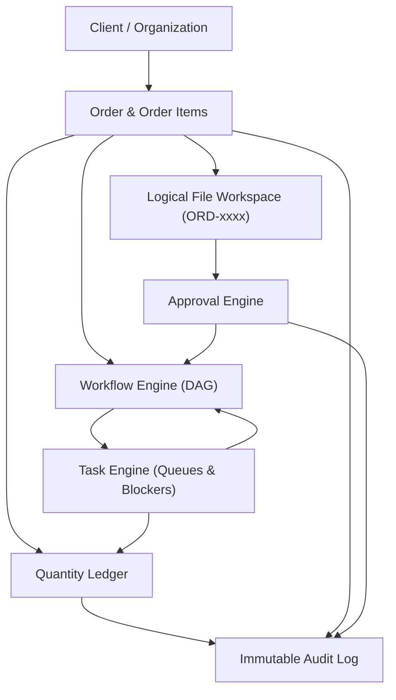

# 01. Architecture - OfficeFloww

## Overview
**OfficeFloww** is an internal production-management and office-automation operating system engineered specifically for commercial printing facilities producing ID Cards, Multicolor Printed Lanyards (MPL), Badges, Invitations, Marksheets, and custom print goods.

The system replaces fragmented legacy tools (WhatsApp groups, Excel spreadsheets, Trello boards, and local PC file storage) with a single, highly reliable, and transactional **Modular Monolith**.

---

## Architectural Principles

### 1. Modular Monolith over Microservices
- Single codebase, single deployable artifact, zero distributed network latency.
- Explicit domain modules (`core`, `auth`, `users`, `clients`, `products`, `orders`, `workflows`, `tasks`, `files`, `approvals`, `quantities`, `audit`, `notifications`, `automation`, `settings`).
- Cross-domain interactions occur strictly through public service interfaces, never through ad-hoc direct database mutations.

### 2. Backend is the Single Source of Truth
- The frontend (Electron desktop or React Native mobile) is purely a presentation and command layer.
- All business invariants (scrap rates, workflow transitions, access permissions, task blockers, quantity balances) are strictly validated and enforced on the server.

### 3. Asynchronous Non-Blocking Core
- Built with **Python 3.11+**, **FastAPI**, and **SQLAlchemy 2.0 Async**.
- Dialect-agnostic database modeling (`sa.Uuid`, `sa.JSON`) allowing seamless production execution against PostgreSQL 16+ and fast isolated in-memory testing with SQLite.

### 4. Background Job Processing
- Heavy I/O or CPU operations (file checksum verification, batch notification broadcasting, scheduled SLA monitors) are processed asynchronously via **Celery** backed by **Redis**.
- Supports immediate synchronous execution mode (`CELERY_TASK_ALWAYS_EAGER = True`) for local development and test runners.

---

## System Domain Boundaries



---

## Module Directory Structure

```
apps/api/app/
├── core/             # Configuration, Database session, Security, Middleware, Exceptions, WebSockets, Logging
├── auth/             # Login, Token rotation, Logout revocation, Sessions
├── users/            # User model, 10 Operational Roles, Permissions matrix
├── clients/          # Organizations, Contacts, GST & Delivery addresses
├── products/         # Categories, Configurable Products, Bill of Materials (BOM)
├── orders/           # Orders, Order Items, Multi-product orchestration
├── workflows/        # Templates, Parallel DAG steps, Workflow Instances, Step Instances
├── tasks/            # Task generation, Dependencies, Blockers, Priority scoring
├── files/            # S3/MinIO metadata, File versioning (v1..vn), Logical folders
├── approvals/        # Review requests, Decisions, Version locking, Step advancement
├── quantities/       # Double-entry transaction ledger, Scrap rate computation
├── audit/            # Append-only audit trail with correlation IDs & diffs
├── notifications/    # In-app and WebSocket notification foundation
├── automation/       # Trigger-Condition-Action automation engine foundation
└── settings/         # System settings and parameters
```
