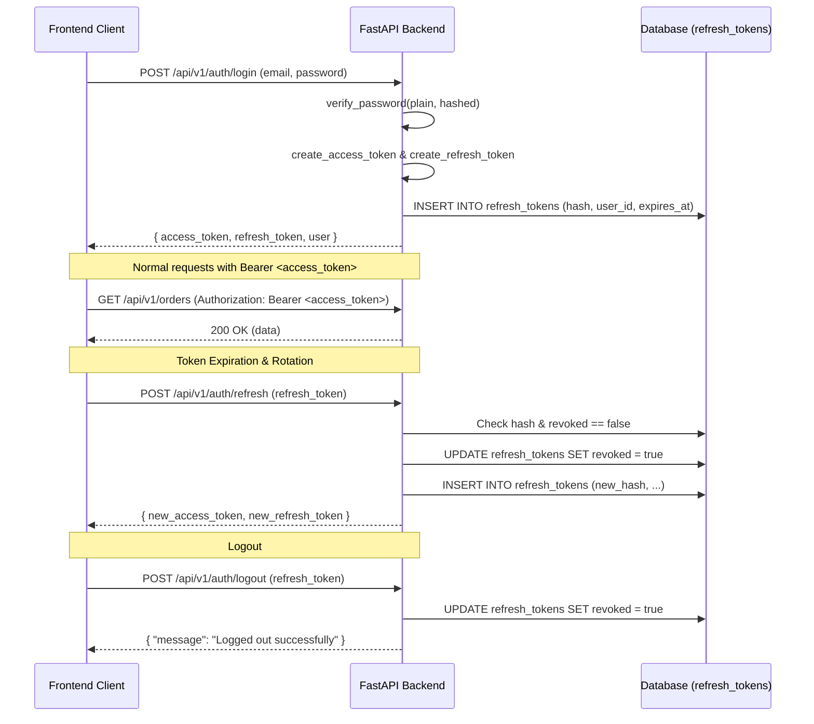

# 04. Authentication Architecture - OfficeFloww

## Overview
OfficeFloww implements an enterprise-grade stateless JWT authentication scheme paired with stateful refresh token rotation and revocation tracking.

---

## Token Model

### 1. Access Token (Short-Lived)
- **Format**: JSON Web Token (JWT) signed with HMAC-SHA256 (`HS256`).
- **Validity**: 60 minutes (`ACCESS_TOKEN_EXPIRE_MINUTES`).
- **Claims**:
  - `sub`: User UUID
  - `role`: User role enum string
  - `type`: `"access"`
  - `exp`: Expiration epoch timestamp
  - `iat`: Issued-at epoch timestamp

### 2. Refresh Token (Long-Lived & Rotating)
- **Format**: Signed JWT with a unique `jti` UUID claim.
- **Validity**: 7 days (`REFRESH_TOKEN_EXPIRE_DAYS`).
- **Storage**: The SHA-256 hash of the refresh token is stored in the PostgreSQL table `refresh_tokens`. The plaintext token is never stored in the database.
- **Rotation Rule**: Every refresh request consumes the existing refresh token, marks it `revoked = true`, and issues a brand new access and refresh token pair. Replaying an old refresh token is immediately rejected.
- **Device Tracking**: The optional `device_info` payload (e.g. `Electron-Desktop-v1.0.0` or `Android-Handheld-Scanner`) is stored alongside the token hash.

---

## Password Security
- Passwords are hashed using the **bcrypt** algorithm with salt factor automatically generated by `bcrypt.gensalt()`.
- Maximum password length is truncated at 72 bytes to conform to the native bcrypt specification.
- Passwords are never logged in structured log outputs or returned in API responses.

---

## Flow Sequence

