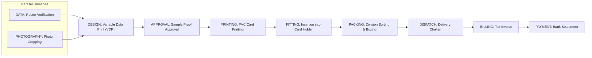

# 06. Workflow Engine - OfficeFloww

## Overview
The OfficeFloww Workflow Engine coordinates production sequences across heterogeneous product lines. Rather than assuming linear execution (Order → Design → Print → Fit), the engine supports configurable **Directed Acyclic Graphs (DAG)** with parallel branches and convergence gates.

---

## Template vs. Instance Architecture
1. **WorkflowTemplate**: Static definition configured per product type. Contains step templates and dependency mappings.
2. **WorkflowInstance**: Instantiated when an `OrderItem` is placed. Modifications to production runs never alter the base template.
3. **WorkflowStepInstance**: Cloned operational step linked to the specific order item.
4. **WorkflowStepInstanceDependency**: Cloned DAG dependency record enforcing execution order.

---

## Step Types

| Step Type | Typical Role | Typical Inputs | Expected Output |
|---|---|---|---|
| `DATA` | DATA_OPERATOR | Excel roster, CSV | Cleaned & normalized records |
| `PHOTOGRAPHY` | DATA_OPERATOR | Photo batch | 300 DPI 35x45mm portrait files |
| `DESIGN` | DESIGNER | Roster + Photos | VDP layout merged PDF |
| `APPROVAL` | MANAGER / CLIENT | Merged proof PDF | Formal sign-off record |
| `PRINTING` | MACHINE_OPERATOR | Approved PDF | Printed PVC / Satin ribbon |
| `PRODUCTION` | MACHINE_OPERATOR | Pre-printed stock | Lamination / Cutting |
| `FITTING` | PACKING_OPERATOR | Cards, clips, hooks | Assembled lanyard / card units |
| `PACKING` | PACKING_OPERATOR | Assembled items | Bundled & boxed sets |
| `DISPATCH` | PROD_MANAGER | Boxed sets | Delivery challan signed |
| `BILLING` | ACCOUNTS | Delivery challan | GST Tax Invoice |
| `PAYMENT` | ACCOUNTS | Invoice | Payment settlement record |
| `CUSTOM` | Configurable | Any | Custom outputs |

---

## Parallel Branching & DAG Convergence
Example: **Standard School ID Card Workflow**:

### State Machine Rules
- When the workflow is instantiated:
  - Any step with 0 dependencies (`DATA` and `PHOTOGRAPHY`) immediately enters `READY` status.
  - Actionable `Task` records are generated for each `READY` step.
  - Dependent steps remain in `PENDING`.
- When an upstream step reaches `COMPLETED`:
  - The engine inspects all downstream dependent steps.
  - A downstream step transitions to `READY` **only if all** its upstream prerequisites are `COMPLETED`.
  - For example, `DESIGN` unlocks only when both `DATA` and `PHOTOGRAPHY` are done.
- When all steps are completed, `WorkflowInstance.status = COMPLETED` and the linked `OrderItem.status = COMPLETED`.
