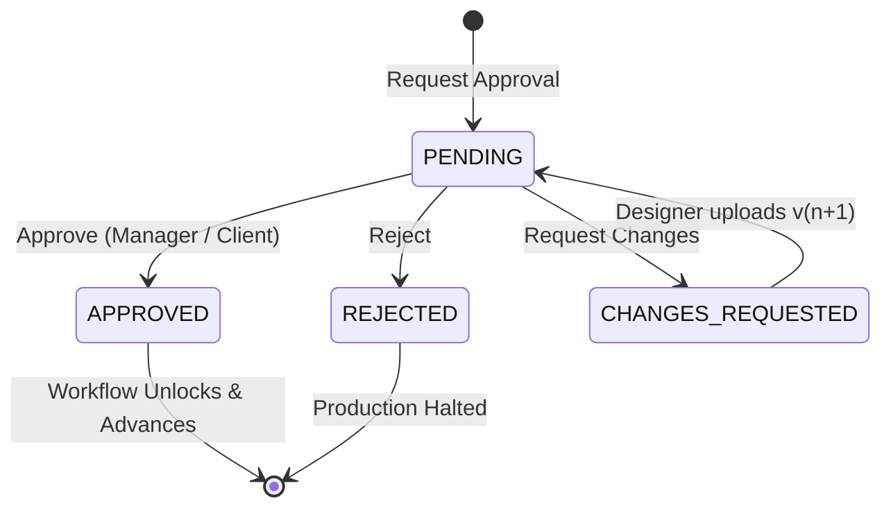

# 09. Approval Engine - OfficeFloww

## Overview
Errors in print production are catastrophic: printing 2,500 ID cards with an unapproved spelling error or incorrect school logo results in 100% material write-offs.
The **Approval Engine** ensures that critical production phases (especially Artwork proofing) are locked until formal sign-off.

---

## Approval Lifecycle

### Approval Entity
- `order_id`: Order reference.
- `file_version_id`: Specific immutable file version being approved (e.g. `student_id_v2.pdf`).
- `workflow_step_instance_id`: Optional link to the workflow approval step.
- `requested_by_id`: User requesting review (typically Designer or Sales).
- `approved_by_id`: Authorized decision maker (Manager or Accounts).
- `status`: `PENDING`, `APPROVED`, `REJECTED`, `CHANGES_REQUESTED`.
- `requested_at`, `responded_at`, `comments`.

---

## Workflow Integration
When `POST /api/v1/approvals/{id}/approve` is invoked:
1. `approval.status` is set to `APPROVED`.
2. The linked `FileVersion.approval_state` is set to `APPROVED`.
3. If linked to an `APPROVAL` workflow step instance, that step transitions to `COMPLETED`.
4. The workflow engine unlocks downstream `PRINTING` steps.
5. An immutable entry is appended to `audit_logs`.
