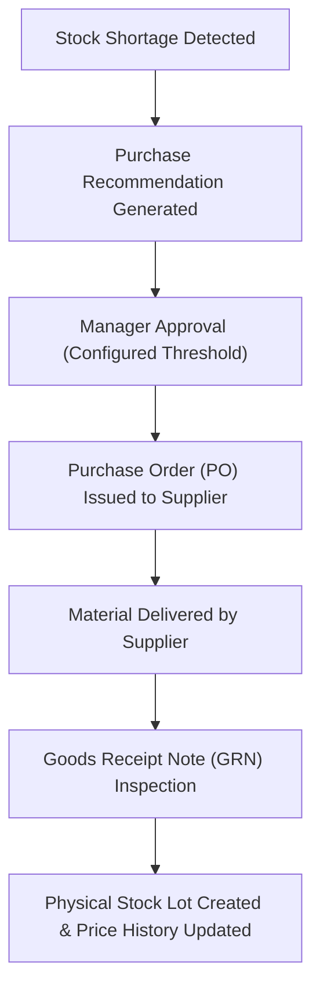

# 17. Purchasing & Supplier Price Analytics

## Overview
The Purchasing module bridges material shortages, procurement planning, purchase orders, goods receipts, and landed cost analytics.

---

## 1. Purchasing Workflow

---

## 2. Supplier Price History & Inflation Trends
Raw material pricing (especially polymers and metals) fluctuates significantly. The system logs every completed receipt into `SupplierPriceHistory`:

$$\text{Absolute Increase} = \text{Current Landed Price} - \text{Previous Landed Price}$$
$$\text{Percentage Increase} = \left(\frac{\text{Absolute Increase}}{\text{Previous Landed Price}}\right) \times 100$$

### Computed Analytics:
- Current Landed Cost vs Last Purchase Price.
- Absolute price escalation ($\Delta \text{₹}$).
- Percentage price escalation ($\Delta \%$).
- Rolling recent weighted average price across the last 5 procurements.
- Multi-supplier cost comparison for identical raw material categories.

---

## 3. Goods Receipt Note (GRN) & Lot Generation
When goods arrive:
1. Receiving operator inspects material and enters `received_quantity`, `accepted_quantity`, and `rejected_quantity`.
2. For accepted units, the system creates a new `StockLot` tied to the PO and supplier.
3. Automatically posts a `RECEIPT` movement into `StockMovement` ledger.
4. Updates the landed cost per unit including tax and transport freight charges.
