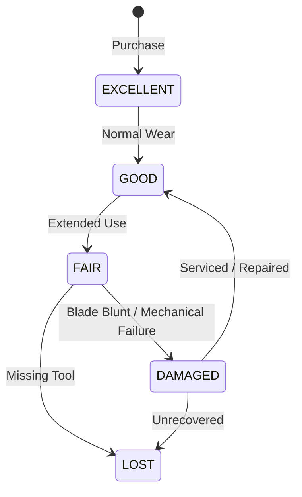

# 23. Tools & Asset Tracking

## Overview
Industrial printing requires specialized tooling: ultrasonic cutters, manual slot punches, eyelet crimpers, heat sealers, and digital calipers. The Assets module prevents tool loss, tracks custodianship, and records physical wear.

---

## 1. Asset Classification & Condition State Machine
Each tool is registered with:
- `asset_code`: Scannable QR code / Barcode.
- `asset_type_id`: Tool category.
- `condition`: State machine tracking tool health:

---

## 2. Check-Out & Check-In Protocols
1. **Issuing**: Operator scans tool QR code. System checks whether `current_holder_id` is null.
   - If already checked out: **Rejects double checkout (HTTP 400)**.
   - If free: Records `AssetAssignment` with `condition_on_issue`.
2. **Returning**: Custodian returns tool to tool crib. Crib manager inspects condition and logs `condition_on_return` with return inspection notes.
3. If condition has degraded (e.g. `GOOD` $\to$ `DAMAGED`), a maintenance alert is dispatched automatically.
