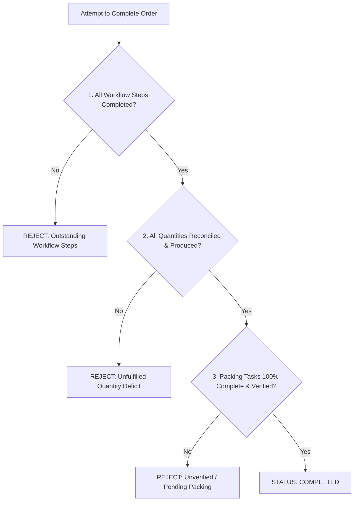

# 27. Billing, Invoicing & The Order Completion Invariant

## Overview
Commercial printing operations require robust client billing and an uncompromising definition of order completion.

---

## 1. GST Invoicing & Payment Tracking
- `Invoice`: Generates tax invoices compliant with Indian GST (18% standard, customizable per product).
- Subtotal + CGST (9%) + SGST (9%) or IGST (18%).
- Multi-installment payment recording (`BANK_TRANSFER`, `UPI`, `CHEQUE`, `CASH`).
- Status lifecycle: `DRAFT` $\to$ `ISSUED` $\to$ `PARTIALLY_PAID` $\to$ `PAID` $\to$ `OVERDUE`.
- `ClientLedger`: Running account balance reflecting issued invoices and credited payments.

---

## 2. The Order Completion Invariant

> **Fundamental Architectural Rule**:
> An order **cannot** transition to `COMPLETED` simply because an operator or manager clicks a button.
> Completion is a cryptographic verification of three immutable operational conditions.

### The Tripartite Completion Condition:

$$\text{Can Complete} = \mathcal{C}_{\text{workflows}} \land \mathcal{C}_{\text{quantities}} \land \mathcal{C}_{\text{packing}}$$

### 1. Workflow Completion ($\mathcal{C}_{\text{workflows}}$):
Every `WorkflowStepInstance` across all order items must be in status `COMPLETED` or `SKIPPED`. If a single step (e.g. Quality Inspection) is pending, completion is denied.

### 2. Quantity Reconciliation ($\mathcal{C}_{\text{quantities}}$):
For every order item, the total `PACKED` quantity recorded in the `QuantityTransaction` ledger must be greater than or equal to the ordered quantity.

### 3. Packing Verification ($\mathcal{C}_{\text{packing}}$):
All associated `PackingTask` entries must be in status `COMPLETED` or `VERIFIED`.

If any condition is unsatisfied, `complete_order()` raises `BusinessRuleViolationError` with a human-readable summary of every breached invariant.
