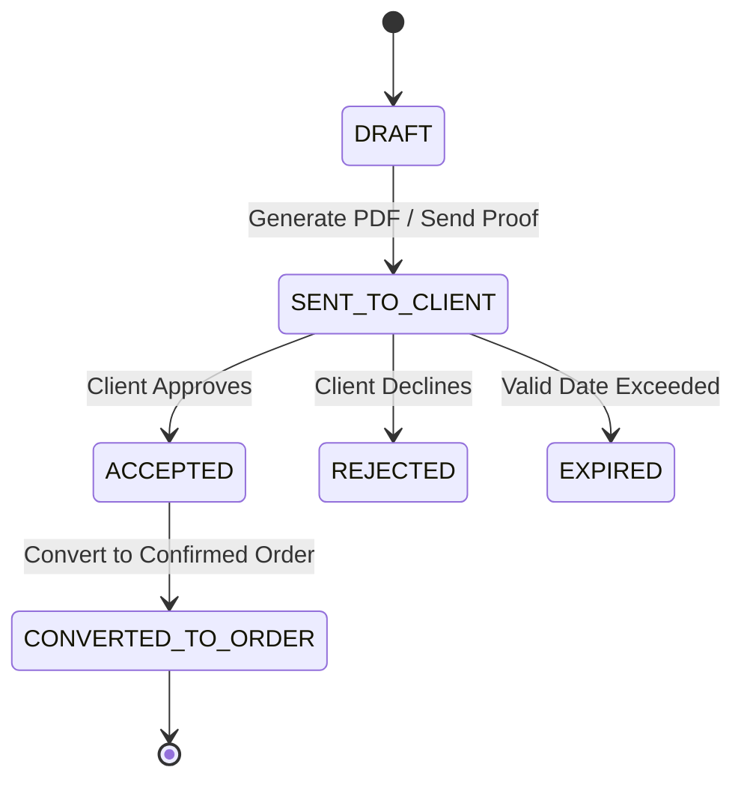

# 29. Quotation Engine & Tiered Pricing Architecture

## 1. Overview
The **Quotation Engine** enables commercial printing enterprises to generate rapid, accurate, and volume-discounted price quotations for institutional and commercial clients. It connects directly with the product catalog, bill of materials (BOM), active supplier landed costs, piece-rate labour configurations, and historical production throughputs.

---

## 2. Core Entities & Lifecycle

### 2.1 Database Models
- `PricingRule`: Top-level configuration bound to a `Product`.
- `PricingTier`: Defines discrete quantity ranges ($Q_{\text{min}} \le Q \le Q_{\text{max}}$) with base unit prices and volume discount percentages.
- `Quotation`: Master record storing sequential identifier (`QTN-YYYYMMDD-XXXX`), client reference, valid until timestamp, subtotal, 18% GST tax, and total amount.
- `QuotationItem`: Line items with product references, custom specifications JSON, calculated unit price, and subtotal.
- `QuotationVersion`: Immutable snapshot history capturing quotation changes over time.

---

## 3. Quantity-Based Pricing Evaluation
Pricing tiers are evaluated deterministically without hardcoded values:

$$\text{Unit Price} = \text{Base Price} \times \left(1 - \frac{\text{Discount \%}}{100}\right)$$

Example volume tier configuration for **Multicolor Printed Lanyards (MPL)**:
| Min Qty | Max Qty | Base Price | Discount % | Effective Unit Price |
|:---|:---|:---|:---|:---|
| 1 | 100 | ₹30.00 | 0.0% | ₹30.00 |
| 101 | 500 | ₹26.00 | 0.0% | ₹26.00 |
| 501 | 1,000 | ₹23.00 | 0.0% | ₹23.00 |
| 1,001 | 5,000 | ₹20.00 | 0.0% | ₹20.00 |
| 5,001 | $\infty$ | ₹18.00 | 0.0% | ₹18.00 |

---

## 4. Quotation to Order Conversion
When a client accepts a quotation:
1. System validates that the quotation is in `DRAFT` or `ACCEPTED` status.
2. Invokes `OrderService.create_order` converting quotation line items into `OrderItem` instances.
3. Automatically instantiates independent DAG workflow templates for each product category.
4. Marks the quotation as `CONVERTED_TO_ORDER` and persists `converted_order_id` for bidirectional audit traceability.
