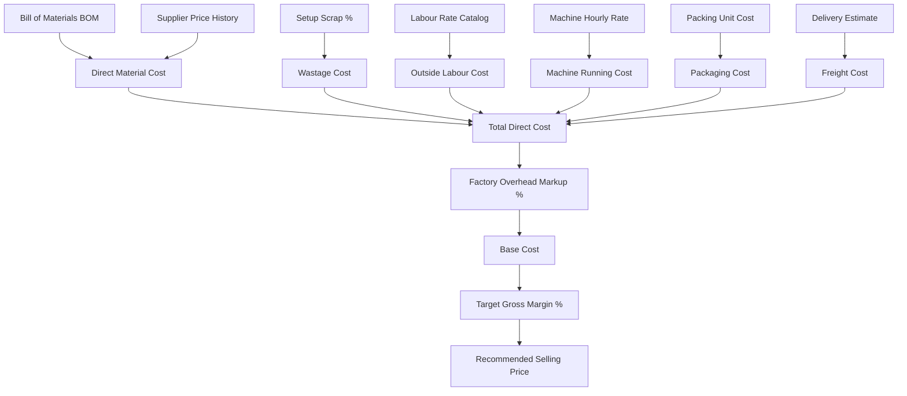

# 30. Deterministic Costing & Feasibility Engine

## 1. Costing Philosophy
Financial and inventory calculations within OfficeFloww are **strictly deterministic** and executed via high-precision `decimal.Decimal` Python arithmetic. LLMs and probabilistic models are strictly prohibited from performing accounting math or setting pricing values.

---

## 2. Comprehensive Cost Formula
The production cost breakdown calculates direct manufacturing costs, setup scrap, outside contractor piece rates, machine hourly operational rates, packing materials, estimated transit freight, factory overhead, and target gross margin.

### 2.1 Formula Definitions

$$\text{Direct Cost} = C_{\text{material}} + C_{\text{wastage}} + C_{\text{labour}} + C_{\text{machine}} + C_{\text{packing}} + C_{\text{delivery}}$$

$$\text{Base Cost} = \text{Direct Cost} \times \left(1 + \frac{\text{Overhead \%}}{100}\right)$$

$$\text{Selling Total} = \frac{\text{Base Cost}}{1 - \frac{\text{Desired Margin \%}}{100}}$$

$$\text{Suggested Unit Price} = \frac{\text{Selling Total}}{\text{Quantity}}$$

---

## 3. Traffic-Light Feasibility Analysis
For every generated quotation or large batch inquiry, the system evaluates:
1. **Raw Material Stock Availability**: Compares available unreserved stock ($A = P - R$) against BOM requirements.
2. **Machine Queue Backlog**: Evaluates scheduled press runtime against shift limits.
3. **Labour Availability**: Verifies active outside contractor capacity.

### Status Thresholds
- **GREEN**: 100% materials available in warehouse; machine capacity < 20 hours; standard delivery feasible.
- **YELLOW**: Heavy production backlog (> 20 hours) or minor lead time buffer required; manager attention advised.
- **RED**: Critical raw material stock deficit or unattainable deadline; automatically generates Purchase Recommendations for missing components.
