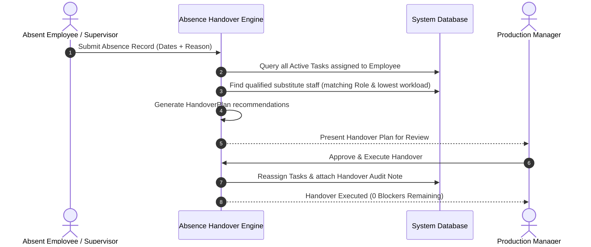

# 31. Capacity Planning, Workload & Absence Handover

## 1. Overview
The **Capacity Planning Engine** tracks resource utilization across machines, floor operators, and outside assembly contractors to eliminate production bottlenecks and prevent employee burnout.

---

## 2. Resource Capacity Metrics
The system calculates daily and weekly workload allocation using standardized 8-hour shift models:

$$\text{Utilization \%} = \left(\frac{\text{Allocated Hours}}{\text{Total Capacity Hours}}\right) \times 100$$

### Workload Classification
- **NORMAL** (< 75% utilization): Healthy queue; ready to accept new expedited jobs.
- **HIGH** (75% - 99% utilization): Approaching shift capacity limit.
- **OVERLOADED** ($\ge$ 100% utilization): Queue exceeds available runtime; triggers automated task rebalancing recommendations.

---

## 3. Employee Absence & Automated Handover Engine

When an employee reports leave (e.g. sick leave, expo travel, personal emergency):

### Sensitive Decision Guardrail
Task handovers and staff reallocations are **recommended** by the system, but require **manager approval** before executing mutations. The system never makes disciplinary or payroll deductions automatically.
