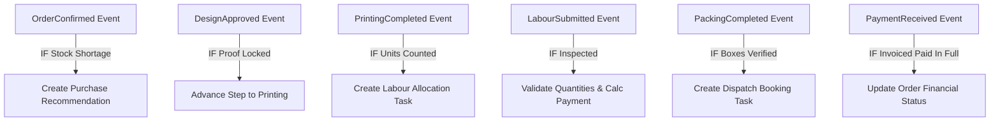

# 34. Idempotent Automation & Rules Engine

## 1. Concept: Event-Condition-Action (ECA)
OfficeFloww features a lightweight, auditable, and idempotent rules engine structured on the universal paradigm:
$$\textbf{WHEN } \text{event} \quad \textbf{IF } \text{conditions} \quad \textbf{THEN } \text{actions}$$

---

## 2. Supported Standard Automation Rules

---

## 3. Idempotency & Safety Guarantees

Every automation execution guarantees:
1. **Zero Duplicate Tasks**: Uses `idempotency_key` (e.g. `EVENT-ORDER-ID-TIMESTAMP`) stored in `idempotency_records`.
2. **Zero Duplicate Stock Issues**: Stock reservation transactions check existing reservations before applying deltas.
3. **Zero Duplicate Invoices or Payouts**: Labour payment generation checks existing unbilled submission IDs.
4. **Full Observability & Audit**: Every rule execution is recorded in `AutomationLog` capturing input payload, executed actions JSON, status (`SUCCESS`, `FAILED`, `SKIPPED`), and error tracebacks.
