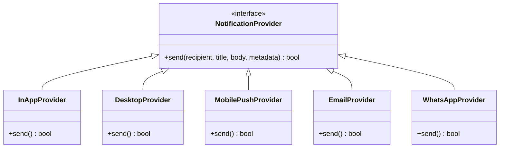

# 35. Multi-Channel Notification Provider Abstraction

## 1. Architectural Design
Core business logic must never depend directly on a single third-party notification vendor. OfficeFloww implements the **Strategy Pattern** via `NotificationProvider` abstract base class.

---

## 2. Channel Implementations
1. **InApp**: Persisted in PostgreSQL database for user notification centers.
2. **Desktop**: Emits WebSocket real-time events to the Electron/Tauri desktop frontend.
3. **MobilePush**: Dispatches Firebase Cloud Messaging (FCM) / Apple Push (APNs) alerts for floor operators and outside contractors.
4. **Email**: SMTP dispatch for invoice PDFs and order confirmation summaries.
5. **WhatsApp**: WhatsApp Cloud API template messaging for client updates.
