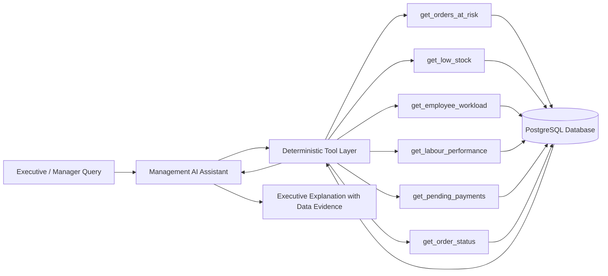

# 39. Management AI Assistant & Deterministic Tool Architecture

## 1. Safety & Responsibility Principles
1. **Zero Probabilistic Financial Calculations**: The AI never directly computes stock, financial totals, GST, piece rates, or ledger balances.
2. **Zero Direct Database Mutations**: The AI assistant interacts exclusively through read-only deterministic backend query tools. All mutations must occur through authorized REST endpoints.
3. **Evidence-Based Answers**: Every generated answer references verifiable raw data evidence.

---

## 2. Controlled Read-Only Tool Layer

---

## 3. Supported Natural Language Questions
- *"What needs attention today?"*
- *"What orders are at risk of missing deadlines?"*
- *"Which materials will run out soon?"*
- *"Who has too much workload on the floor?"*
- *"Who is the fastest MPL labourer?"*
- *"How much money is pending across client invoices?"*
- *"Generate daily executive briefing."*
