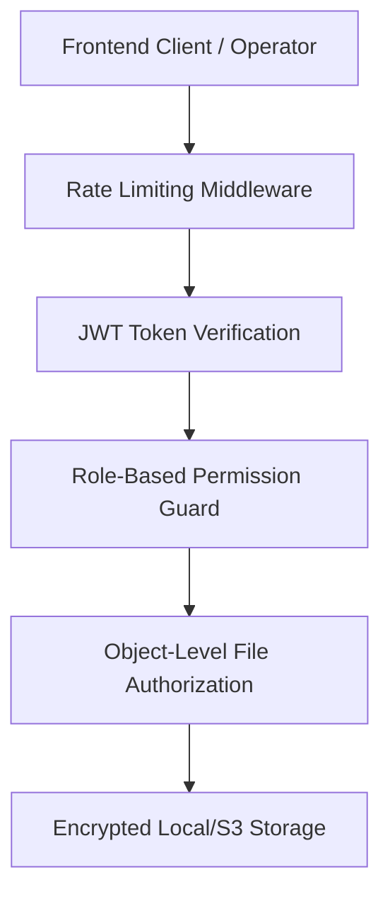

# 41. Enterprise Security & Object-Level File Authorization

## 1. Threat Model & Sensitive Assets
In a high-volume commercial printing facility, sensitive data assets include:
1. **Student Personal Identifiable Information (PII)**: Full names, photos, birthdates, addresses for school ID cards.
2. **Proprietary Artwork & Vector Designs**: Client intellectual property and vectorized brand files.
3. **Financial Records**: Supplier pricing agreements, contractor piece rates, client GST invoices.

---

## 2. Security Controls & Architecture

### 2.1 Least Privilege & Role Permissions
- **Press Operators**: Floor API access only; can log output quantities and timers; zero financial access.
- **Outside Labourers**: Scoped to assigned batches; zero access to customer PII or company financials.
- **Client External Viewers**: Access restricted to specific tokenized file proofs; zero system access.

### 2.2 Object-Level File Authorization
- Operators can only download and view files explicitly attached to their active, assigned tasks.
- Public file URL directory browsing is completely blocked.
- Storage keys use cryptographically random UUIDs and SHA-256 integrity checksums.
