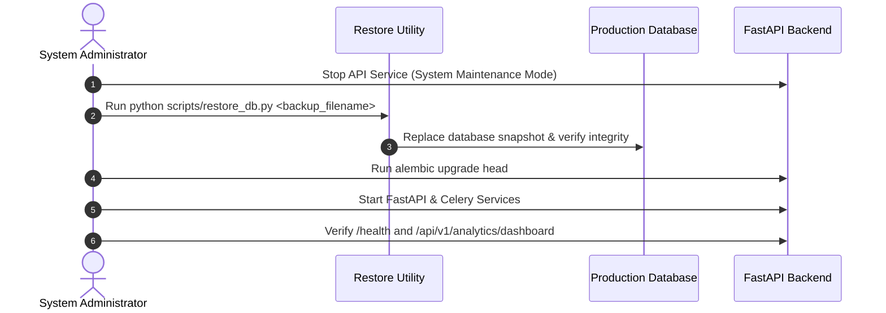

# 43. Disaster Recovery & Restoration Runbook

## 1. Disaster Recovery Objectives
- **Recovery Point Objective (RPO)**: < 1 Hour (maximum data loss window).
- **Recovery Time Objective (RTO)**: < 15 Minutes (system recovery time).

---

## 2. Step-by-Step Restoration Runbook



### 2.1 Restoring Database Snapshot
```bash
# SQLite Development Restore:
python scripts/restore_db.py officefloww_backup_20260902_150000.db

# PostgreSQL Production Restore:
pg_restore -h localhost -U postgres -d officefloww -v "backups/officefloww_pg_20260902_150000.dump"
```

### 2.2 Re-running Migrations
```bash
alembic upgrade head
```

### 2.3 Health & Integrity Verification
```bash
curl http://localhost:8000/health
# Expected: {"status": "healthy", "service": "OfficeFloww", "version": "3.0.0"}
```
