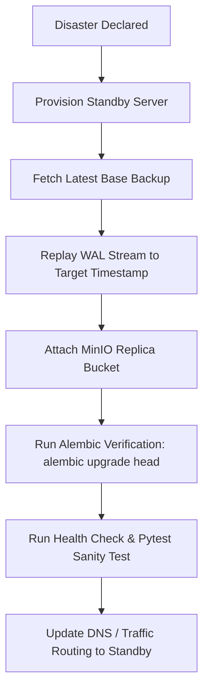

# 46. Backup & Disaster Recovery Runbook

## 1. Overview & Objectives

OfficeFloww stores mission-critical transactional records for the printing company:
- Client ledgers and invoicing state
- Stock lot lineages, warehouse movements, and physical balances
- Labour material credits and contractor payout histories
- Production batch logs, scrap tracking, and approved artwork proofs

**Recovery Time Objective (RTO)**: < 15 minutes  
**Recovery Point Objective (RPO)**: < 5 minutes (via continuous WAL archiving)

---

## 2. PostgreSQL Backup Strategy

### Continuous Physical Backup (pgBackRest / WAL Archiving)
- **Archive Destination**: Secure offsite S3-compatible object storage.
- **WAL Shipping Frequency**: Immediate on 16MB boundary or maximum 60 seconds interval.
- **Retention**: Full weekly base backup + daily differential + continuous WAL retention for 30 days.

### Automated Logical Backup (`pg_dump`)
Cron schedule: Daily at `02:00 UTC`.
```bash
pg_dump -Fc -h "$DB_HOST" -U "$DB_USER" -d "$DB_NAME" \
  --exclude-table-data="audit_logs_archive" \
  -f "/backups/officefloww_$(date +%Y%m%d_%H%M%S).dump"
```

---

## 3. MinIO / S3 Artwork & File Version Storage Backup

- **Storage Location**: `/storage/production_files`
- **Object Versioning**: Enabled natively.
- **Replication**: Bi-directional bucket replication to secondary failover datacenter.
- **Integrity Validation**: SHA-256 hash comparison against `file_versions.checksum` table column.

---

## 4. Disaster Recovery Procedure (Step-by-Step)



1. **Verify Storage Availability**:
   ```bash
   aws s3 ls s3://officefloww-backups/base/
   ```
2. **Restore Base Image & Replay WAL**:
   ```bash
   pgbackrest --stanza=officefloww --type=time "--target=2026-09-02 10:00:00" restore
   ```
3. **Database Sanity Check**:
   ```sql
   SELECT count(*) FROM orders;
   SELECT count(*) FROM stock_lots;
   SELECT count(*) FROM client_ledger;
   ```
4. **Boot Application Containers**:
   ```bash
   docker-compose -f docker-compose.prod.yml up -d
   ```
5. **Execute Health Probe**:
   ```bash
   curl -f http://localhost:8000/api/v1/health
   ```
