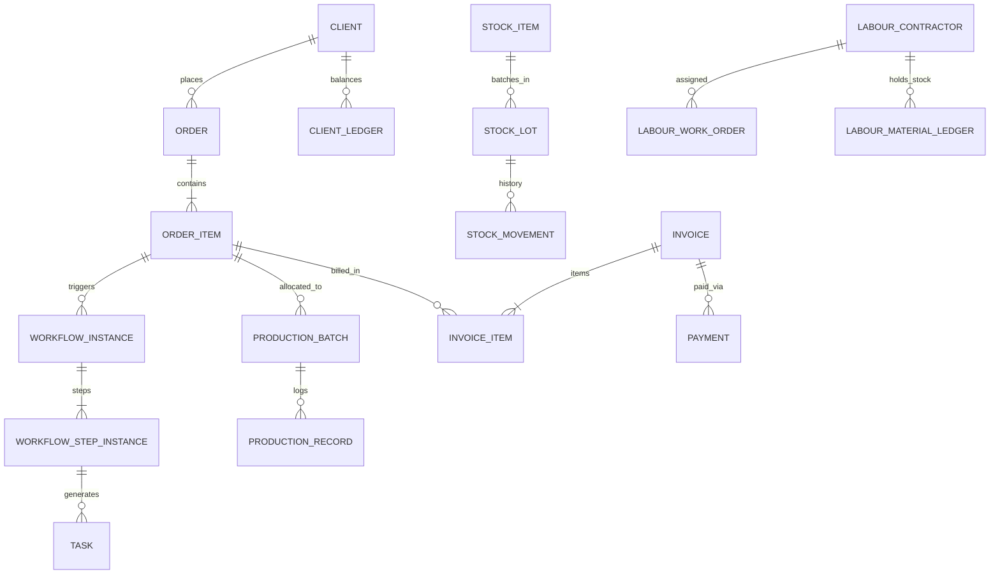

# 49. Final Database Reference & ERD Documentation

## 1. Schema Architecture Overview

The database is built on PostgreSQL with strict relational integrity, UUID primary keys, UTC timestamp tracking, and foreign key cascades/restrictions.

---

## 2. Table Catalog by Domain Layer

### 1. Identity & Permissions
- `users`: User profiles, email, argon2 password hash, role enum, active status.
- `audit_logs`: Immutable security and data mutation logs (actor, entity, before/after diffs, correlation ID).

### 2. Commercial & Clients
- `clients`: Customer details, tax identifiers (GSTIN), billing & delivery addresses.
- `client_contacts`: Key personnel per client (name, phone, email, designation).
- `quotations` & `quotation_items`: Pricing quotations with line-item BOM and margin breakdown.
- `orders` & `order_items`: Confirmed sales orders, quantities, pricing, priority, status.

### 3. Products & Engineering
- `product_categories`: Category classifications (MPL, ID Cards, Badges, etc.).
- `products`: Product master catalog linked to category and default workflow template.
- `bill_of_materials`: Multi-versioned BOM headers (`version`, `is_active`).
- `bom_items`: Raw material components, consumption ratios per unit, wastage allowances.

### 4. Orchestration & Tasks
- `workflow_templates` & `workflow_step_templates`: DAG templates with transitions and dependencies.
- `workflow_instances` & `workflow_step_instances`: Runtime execution state for orders.
- `tasks`: Actionable tasks assigned to roles or users (`READY`, `IN_PROGRESS`, `COMPLETED`, `BLOCKED`).
- `files`, `file_folders`, `file_versions`, `file_links`: File management with SHA-256 validation.

### 5. Warehouse, Purchasing & Inventory
- `stock_locations`: Storage areas (`MAIN_STORE`, `PRODUCTION`, `OUTSIDE_LABOUR`).
- `stock_items`: Raw material SKU catalog with min stock thresholds.
- `stock_lots`: Material lots with supplier info, cost per unit, expiry dates.
- `stock_movements`: Stock transaction journal (`RECEIPT`, `ISSUE`, `CONSUMPTION`, `TRANSFER`).
- `stock_reservations`: Soft and hard reservations tied to confirmed orders.
- `suppliers`, `purchase_orders`, `purchase_order_items`: Supplier catalog and purchasing flow.

### 6. Physical Production, Labour & Logistics
- `machines`: Physical printing/punching presses, serial numbers, maintenance schedules.
- `production_batches`: Allocated batch slices linked to approved file versions and machines.
- `production_records`: Good output, scrap, and reject journals per operator shift.
- `labour_contractors`: External/internal piece-rate workers.
- `labour_work_orders`: Piece-rate job assignments.
- `labour_material_ledger`: Material credit tracking held by external contractors.
- `packing_tasks`, `packing_boxes`, `packing_items`: Package barcoding and verification.
- `shipments`: Courier, local driver, or customer pickup dispatch records.

### 7. Financial & Ledger Integrity
- `invoices` & `invoice_items`: Formal billing documents with GST/tax breakdown.
- `payments`: Customer payments (`BANK_TRANSFER`, `UPI`, `CASH`, `CHEQUE`).
- `client_ledger`: Double-entry accounting journal (`INVOICE`, `PAYMENT`, `CREDIT_NOTE`).
- `quantity_transactions`: Double-entry item tracking (`PLANNED`, `PRODUCED`, `PACKED`, `DISPATCHED`).

### 8. Automation & Omnichannel
- `automation_rules` & `automation_logs`: Event-condition-action engine.
- `idempotency_records`: Idempotent suppression cache with 48h TTL.
- `notifications`: Omnichannel dispatch records (`IN_APP`, `WHATSAPP`, `EMAIL`, `SMS`).
- `proof_approval_links`: Secure client proof tokens for public approval portal.
- `absence_records`: Employee absence and automated workload handover plans.
