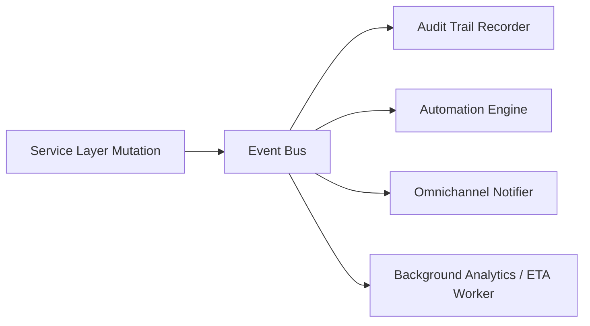

# 51. Final Domain Event Catalog

## 1. Domain Event Architecture

All domain mutations emit asynchronous, strongly-typed events to Redis PubSub and the internal Celery event dispatcher.

---

## 2. Event Registry

| Event Name | Trigger Condition | Standard Payload Fields | Downstream Handlers |
|---|---|---|---|
| `OrderCreated` | New draft order recorded | `order_id`, `client_id`, `total_amount` | Notification to sales rep |
| `OrderConfirmed` | Order accepted & advance recorded | `order_id`, `client_id`, `advance_amount` | Instantiates workflow DAG, reserves stock |
| `ArtworkProofUploaded` | Designer uploads new proof version | `file_version_id`, `order_id`, `file_name` | Creates approval task, generates proof link |
| `ProofApprovedByClient` | External client accepts proof via web link | `file_version_id`, `client_id`, `token` | Unblocks prepress & production workflow steps |
| `ProofRejectedByClient` | External client requests revisions | `file_version_id`, `reason`, `client_id` | Reopens design task, alerts assigned designer |
| `StockShortageDetected` | BOM reservation exceeds physical stock | `item_id`, `order_id`, `shortage_qty` | Creates draft Purchase Order alert |
| `ProductionBatchCompleted` | Batch output and scrap logged | `batch_id`, `good_qty`, `scrap_qty` | Updates quantity ledger, triggers packing task |
| `PackingCompleted` | All boxes sealed and verified | `order_id`, `boxes_count`, `total_qty` | Triggers dispatch shipment generation |
| `ShipmentDispatched` | Courier waybill created & handed over | `shipment_id`, `tracking_number`, `carrier` | Sends WhatsApp dispatch alert with tracking link |
| `ShipmentDelivered` | Delivery confirmation received | `shipment_id`, `pod_url`, `received_by` | Updates order state, checks billing completion |
| `InvoiceIssued` | Tax invoice generated | `invoice_id`, `client_id`, `total_amount` | Posts debit to `client_ledger`, sends invoice PDF |
| `PaymentReceived` | Customer payment recorded | `payment_id`, `invoice_id`, `amount` | Posts credit to `client_ledger`, checks order close |
| `UserAbsencePlanned` | Designer / operator records leave | `user_id`, `start_date`, `end_date` | Generates task handover plan & reassignments |
