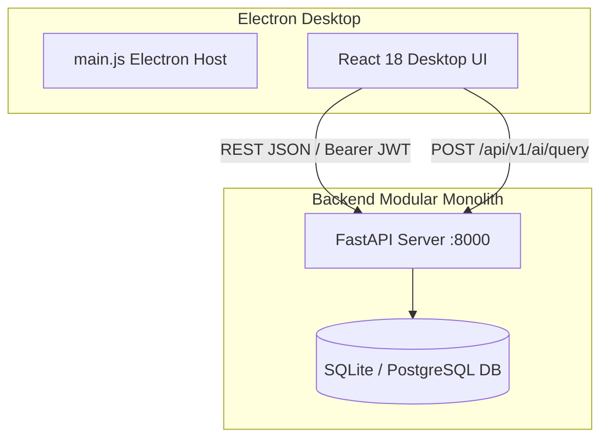

# 01 — UI & Desktop Architecture

## 1. Architectural Stack

PrintFlow is an enterprise-grade desktop operational suite built with:
- **Electron 28+**: Cross-platform desktop host with isolated context and secure IPC bridges.
- **React 18.2**: Component-driven desktop UI leveraging functional hooks, fast reconciliation, and memoized tables.
- **TypeScript 5.x**: End-to-end type safety shared between the desktop frontend and the FastAPI backend.
- **esbuild**: Sub-100ms ultra-fast incremental bundler configured for browser platform compilation.
- **Vanilla CSS + Token Variables**: Zero runtime overhead, strict variable enforcement via CSS custom properties.

---

## 2. Directory Layout

```
apps/desktop/
├── assets/
│   ├── logo.png               # Official PrintFlow logo asset
│   └── favicon.png            # Desktop runtime window icon
├── dist/
│   ├── bundle.js              # Bundled JavaScript output
│   └── bundle.js.map          # Source map for fast debugging
├── src/
│   ├── api/                   # HTTP client & API service abstractions
│   ├── auth/                  # RBAC state & role navigation rules
│   ├── design-system/         # Reusable atomic UI components & tokens
│   │   ├── components/        # Button, Card, Table, Drawer, Modal, Icon
│   │   ├── layouts/           # PageHeader, ShellLayout
│   │   └── tokens/            # index.css, theme.ts
│   ├── hooks/                 # useAsync, useConnection, useToast
│   ├── layout/                # AppShell, TopBar, Sidebar
│   └── views/                 # 7 primary workspaces
│       ├── auth/              # LoginView
│       ├── dashboard/         # DashboardView (Shortcut & Action Center)
│       ├── tasks/             # TasksView (Work Manager, Kanban, Drawers)
│       ├── staff/             # StaffView (Employees, Labour, Workload)
│       ├── stock/             # StockDashboardView (Spreadsheet register, POs)
│       ├── clients/           # ClientsView (Clients, Orders, Quotations)
│       ├── billing/           # BillingView (Invoices, Payments, Ledger)
│       ├── settings/          # SettingsView (2-column system config)
│       └── voice/             # VoiceAssistantBar (Context AI query)
├── index.html                 # Main Electron HTML entrypoint
└── main.js                    # Electron main process & window controller
```

---

## 3. Communication Model



All interactions use standard HTTP/HTTPS REST queries with JSON payloads and Bearer tokens stored in session memory or encrypted local configuration.
