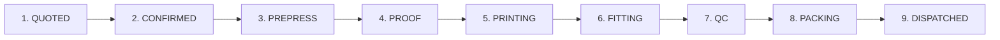

# 13 — 9-Stage Order Lifecycle UX

Every manufacturing job moves through a strictly enforced, visual 9-stage sequence:

---

## 1. Stage Definitions & Gate Requirements

1. **QUOTED / DRAFT**: Initial commercial inquiry, item quantities, and pricing estimation.
2. **CONFIRMED**: Commercial agreement reached, advance payment recorded, BOM inventory automatically reserved in `Stock`.
3. **PREPRESS & ARTWORK**: Graphic design team prepares continuous ribbon repeat layouts and high-resolution vector files.
4. **PROOF APPROVAL**: Client coordinator digitally approves the artwork sample before production begins.
5. **PRINTING / SUBLIMATION**: High-speed thermal rotary sublimation press produces printed polyester ribbon or PVC sheets.
6. **ASSEMBLY & FITTING**: Metal dog-hooks, safety breakaway clips, or badge pins assembled by contractors or in-house operators.
7. **QUALITY CONTROL (QC)**: 100% inspection for print sharpness, hardware integrity, and defect rate recording.
8. **PACKING & BUNDLING**: Bundled in lots of 50/100, verified on precision scale, labeled with tracking barcode.
9. **DISPATCHED / DELIVERED**: Consignment handed over to logistics courier; tax invoice finalized in `Billing`.
